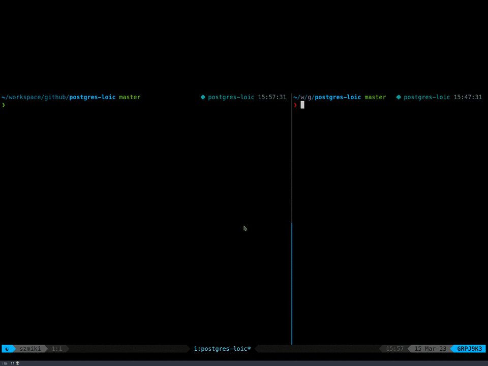

# PostgreSQL Low Orbit Ion Cannon (`postgres-loic`)  
  
## task description  
  
Create an application that will overload the connection pool of a PostgreSQL deployment.   
The application should attempt to connect to the PostgreSQL deployment simultaneously in threads (ex using 200 threads)  
Additionally, create a video recording demonstrating the application's execution.   
On the left side of the screen, show the log of the Python application attempting to connect to the PostgreSQL deployment.   
On the right side of the screen, show a terminal attempting to connect to the PostgreSQL deployment every 1 second.  
At some point, the PostgreSQL deployment should return an error indicating that the connection pool is exhausted and it is impossible to connect for a regular user.  
  
## requirements  
  
- The application should use threads to simulate multiple simultaneous connections to the PostgreSQL deployment.   
- The video recording should clearly show the execution of the application and the error message returned by the PostgreSQL deployment when the connection pool is exhausted.  
- The application should be written in Python and use the `psycopg2` library to connect to the PostgreSQL deployment.   
- The PostgreSQL deployment should be set up to use connection pooling.  
  
## usage

Required runtimes:

- [Python >= 3.8](https://www.python.org/downloads/)
- [Docker](https://docs.docker.com/get-docker/)
- [`psql` command-line tool](https://docs.timescale.com/timescaledb/latest/how-to-guides/connecting/psql/)
  
1. create a virtual environment
    ```sh
    python -m venv .venv
    ```

2. activate the virtual environment
    ```sh
    source .venv/bin/activate
    ```

3. install dependencies
    ```sh
    pip install -r requirements.txt
    ```

4. export the necessary environment variables
    ```sh
    source .env
    ```

5. (optional) verify the variables
    ```sh
    printenv | grep PG
    ```

6. spin up a docker container with a PostgreSQL instance
    ```sh
    docker compose up -d
    ```

7. in one shell session run the simulation script
    ```sh
    python main.py
    ```

8. in another shell session invoke `psql`
    ```sh
    psql -h $PGHOST -p $PGPORT -U $PGUSER -c 'SELECT SUM(numbackends) FROM pg_stat_database;'
    ```

9. notice how PostgreSQL cannot handle any more connections 🙃


